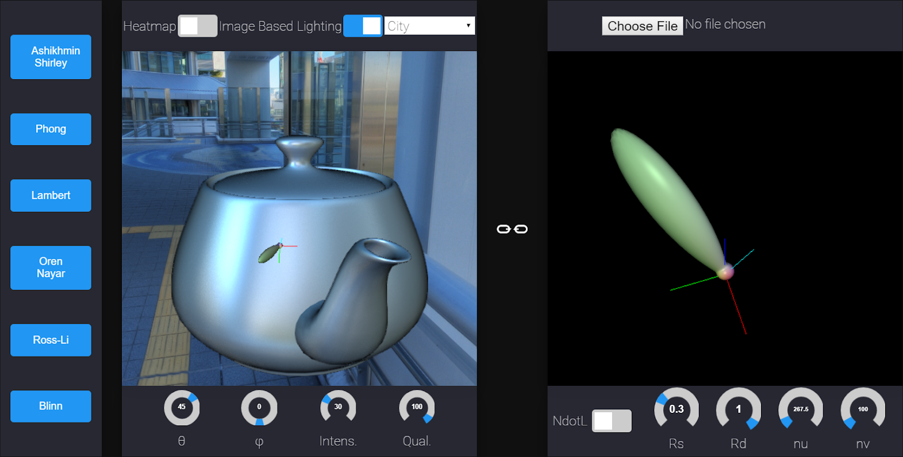

# BSDF-Visualizer

## System Requirements
* WebGL 2 required.
* **Windows / Mac**: Chrome recommended.
* **Linux**: Firefox is recommended (see below).
* For Firefox: `about:config` > set `dom.moduleScripts.enabled` to `true`

## Demo
* Available LIVE here: https://n8vm.github.io/BSDF-Visualizer/

## Hacking
See [our documentation wiki](https://github.com/n8vm/BSDF-Visualizer/wiki).

### Using Glslify with shaders
[Glslify](https://github.com/glslify/glslify) is quite handy and I am currently
using it for our heatmap. Our glslify-enabled shaders are in `Shaders/glslify_raw`.
In order to work with these shaders:

0. Make sure glslify is set up correctly
  1. `npm install -g glslify` to install the CLI command.
  2. `npm install` to install local glslify dependencies
1. Edit the shader in `Shaders/glslify_raw`.
2. Run `preprocess_glslify_shaders.py`. This will generate (inlined) shaders and
place them under `Shaders/glslify_processed`. :warning: Do not edit the shaders under
`glslify_processed`. They will get overwritten by `preprocess_glslify_shaders.py`
